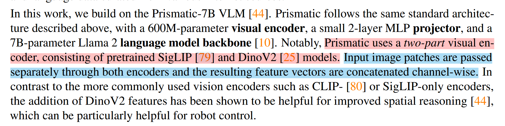
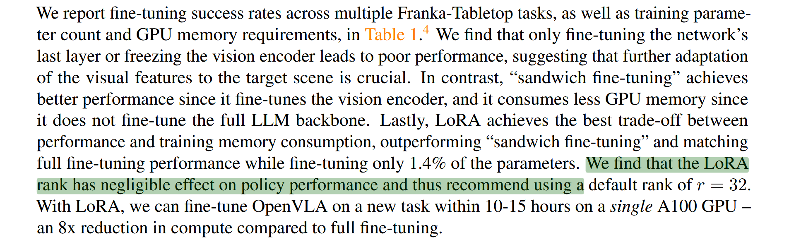
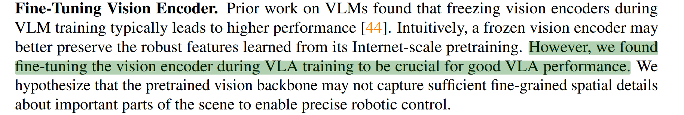
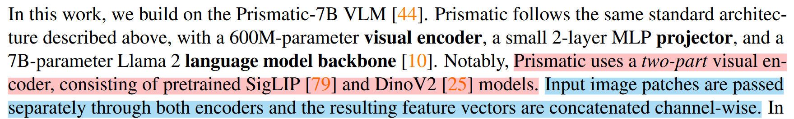
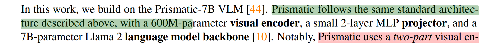
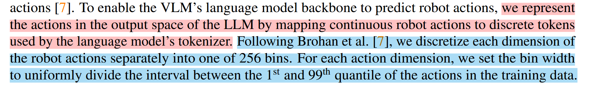

# 1.痛点：
- 以前的模型泛化能力差
- 好的模型都是闭源，难以学习
- 算力太高，高校没有能力去做‘

# 2.创新点
### 1. 独特的“双路融合”视觉编码器架构

这是 OpenVLA 最核心的架构创新。传统的 VLM 或 VLA 通常只使用一个视觉编码器（如 CLIP 或 SigLIP），而 OpenVLA 采用了**混合视觉编码器**。

- **创新点：** OpenVLA 的视觉主干结合了 **SigLIP**（擅长语义理解）和 **DinoV2**（擅长空间几何特征）。
    
- **具体实现：** 输入的图像块（patches）分别通过这两个编码器，生成的特征向量在通道维度（channel-wise）上进行拼接 。
    
- **优势：** 相比于仅使用 SigLIP 或 CLIP 的模型，引入 DinoV2 显著增强了模型的**空间推理能力（spatial reasoning）**，这对机器人精确操作物体至关重要 。实验表明，这种融合架构比单视觉编码器（仅用 SigLIP）的性能高出约 5% 。

### 2. 参数高效微调（LoRA）与量化技术的引入

之前的 VLA 模型（如 RT-2-X）通常是封闭的，且微调需要巨大的计算资源。OpenVLA 是首个证明了现代参数高效微调技术在 VLA 上有效的模型。

- **创新点：** 首次将 **LoRA (Low-Rank Adaptation)** 和**模型量化（Quantization）**技术应用于 VLA 领域 。

- **优势：消费级显卡可用：** OpenVLA 可以在消费级 GPU（如 RTX 4090）上通过 4-bit 量化进行推理，且性能相比全精度（bfloat16）几乎没有下降 。 **微调成本低：** 使用 LoRA 使得在单个 A100 GPU 上仅需几小时即可完成对新任务的微调，而无需重新训练整个模型 。相比之下，全量微调需要多卡集群。

- **LoRA：** 用于微调大模型，只调整模型小部分参数。在 OpenVLA 中，全量微调需要更新所有参数，显存压力极大；而 LoRA 只需要训练 **1.4%** 的参数
- **量化：** 降点模型内部的浮点数的精度。原本模型里的权重数字是非常精确的（比如 16 位浮点数 `3.1415926...`），量化就是把它变得“粗糙”一点（比如 4 位整数 `3`） 
    

### 3. 全参数微调的训练策略（打破“冻结”惯例）

在以往的 VLM/VLA 研究中（如 Prismatic VLM），通常的做法是冻结视觉编码器，只训练语言模型部分，以保留预训练特征。

- **创新点：** OpenVLA 在训练过程中**没有冻结视觉编码器**，而是对整个模型（包括视觉编码器、投影层和 LLM 主干）进行了全量微调 。
    
- **原理与效果：** 论文发现，预训练的视觉主干可能无法捕捉到机器人操作所需的细粒度空间细节。解冻并微调视觉编码器对于获得高性能至关重要，实验显示微调视觉编码器的成功率（80%）远高于冻结视觉编码器（46.7%）。
# 3.方法
### 1. 输入是什么 (Inputs)

OpenVLA 是一个视觉-语言-动作模型，它的输入包含两个模态：

- **视觉输入 (Image Observation)：** 机器人当前的单张相机视角图像 。在 OpenVLA 的最终设计中，为了平衡计算开销和性能，输入图像的分辨率被统一处理为 $224 \times 224$ 像素 。
    
- **语言指令 (Language Instruction)：** 用户给出的自然语言文本，比如 `"Put eggplant in bowl"`（把茄子放进碗里） 。

### 2. 输出是什么 (Outputs)

- **动作输出 (Robot Action)：** 模型最终输出的是一个 **7维的连续机器人动作向量 (7D Robot Action)** 。
    
- 这 7 个维度通常代表机器人末端执行器（夹爪）的绝对或相对控制量，具体包括：3 个空间位置偏移量 ($\Delta x, \Delta y, \Delta z$)，3 个旋转角度偏移量 ($\Delta \theta$ 或者 roll, pitch, yaw)，以及 1 个夹爪的开合状态 ($\Delta Grip$) 。
    
---

## 3.通用处理（训练和推理共用）

要让一个原本只会“文字接龙”的语言模型（Llama 2）输出物理世界的连续动作，OpenVLA 巧妙地将动作预测转化为了一个视觉-语言序列生成”任务 。
### 视觉特征编码 (Vision Encoding)

首先要把图像变成模型能理解的“词”。

- 输入的图像会被切分成许多小的图像块（Patches），分别送入 DinoV2 和 SigLIP 这两个视觉编码器 。
    
- 这两个编码器提取出的特征向量会在通道维度上进行拼接 (concatenated channel-wise)，形成融合了空间几何与语义信息的强大视觉特征 。

### 模态对齐投影 (MLP Projection)

- 视觉特征虽然提取出来了，但语言模型（Llama 2）还不认识它们。因此，模型使用了一个轻量级的两层多层感知机（2-layer MLP projector）作为桥梁 。
    
- 这个投影层将上一步的视觉特征向量，直接映射到 Llama 2 语言模型的词嵌入空间（Language embedding space）中，让图像变成了 LLM 可以直接处理的“视觉 Token” 。

### 核心魔法 —— 动作离散化 (Action Discretization)

这是 OpenVLA 能够输出动作的最核心方法。语言模型只能输出离散的词汇（Token），怎么让它输出连续的 7 维物理坐标呢？
 📝 直白翻译
- **第一句：** 借鉴 Brohan 等人的方法，我们将机器人动作的每一个维度分别离散化为 256 个区间（bins）。

- **第二句：** 对于每一个动作维度，我们设定区间宽度，将训练数据中动作的第 1 百分位数到第 99 百分位数之间的范围进行均匀划分 。

 ### **深度大白话解析**

大语言模型（比如 Llama 2）天生只能输出一个个离散的“词”（Token），但机器人的动作是连续的数字（比如向前移动 1.2345 厘米）。怎么让模型准确输出这个动作呢？这就需要用到**“离散化（Discretization）”**和**“分箱（Binning）”**。

**第一部分：切分 256 个“小格子”（Bins）** 想象你有一把尺子，代表机器人在 X 轴上可以移动的完整范围。论文的做法是把这把尺子切成 256 个等长的“小格子”。 每个格子对应一个专属的 Token。如果模型最终预测出“第 128 个格子对应的 Token”，我们就知道机器人大概要移动多少距离了。

**第二部分：为什么是“第 1 到第 99 百分位数（quantile）”？** 这正是这句话最精妙、也最容易让人卡壳的地方！论文紧接着的下一句话解释了这个设计的初衷：为了避免受到极端异常值的干扰 。

我们可以用一个具体的例子来理解：

- 假设在收集的几万条训练数据里，机器人平时在 X 轴上移动的距离绝大多数都在 **-10 厘米到 +10 厘米** 之间。
    
- 但是，现实世界的数据是很脏的。传感器偶尔会抽风，记录下了一个 **+500 厘米** 的“离群值（outlier）”。
    
- 如果按照**绝对的最大值和最小值**来定义这把尺子的长度（即 -10 厘米到 +500 厘米），那这把尺子就会被拉得特别长。把这么长的尺子切成 256 份，每个小格子代表的误差就太大了，动作颗粒度会变得非常粗糙，导致机器人操作极其不精确 。
    
- **“掐头去尾”的聪明策略：** 为了解决这个问题，研究人员把所有动作数据从小到大排好，直接砍掉最小的 1% 和最大的 1%，只取中间 98% 最常见、最正常的动作数据范围（也就是第 1 到第 99 百分位数）

## 🔥训练过程
在训练阶段，OpenVLA 并不是像传统的控制算法那样去拟合一个具体的连续数值，而是完全把自己伪装成一个“语言模型”，通过“做文字选择题”的方式来学习动作。完整的训练流程分为以下四步：
#### 第一步：动作数据预处理与离散化 (Action Discretization)

- **掐头去尾：** 系统首先扫描整个训练数据集，提取所有连续的机器人动作轨迹。为了排除传感器故障导致的极端异常值，仅保留动作分布在 **第 1 百分位数到第 99 百分位数** 之间的有效数据。
    
- **分箱切分 (Binning)：** 将这段有效数据范围均匀切分为 **256 个区间（Bins）**。这样，原本连续的物理动作（如坐标、角度）就被转换成了 $0 \sim 255$ 的离散整数（格子编号）。
    
#### 第二步：改造模型词表 (Vocabulary Overwriting)

- **偷梁换柱：** 由于 Llama 2 语言模型只能输出“词（Token）”，系统强行将 Llama 2 分词器（Tokenizer）词表中**最后 256 个最不常用的生僻词**抹去。
    
- **赋予新义：** 将这 256 个被覆盖的 Token，重新定义为代表上述 256 个动作区间的“动作 Token”。至此，模型拥有了直接输出动作指令的能力，且无需改变底层网络结构。

#### 第三步：前向传播与特征融合 (Forward Pass)

- **视觉处理：** 训练集中的当前帧图像被切片，分别送入 **DinoV2**（提取空间特征）和 **SigLIP**（提取语义特征）。特征拼接后，通过一个 2 层 MLP 投影层，转化为 LLM 能理解的“视觉 Token”。
    
- **序列拼接：** 将“视觉 Token”与“文本指令 Token”（例如："What should the robot do to put eggplant in bowl? A:"）拼接在一起，送入 70亿参数的 Llama 2 大模型中。
    
#### 第四步：精准打分与参数更新 (Loss Calculation & Update)

- **掩码机制 (Masking)：** 在计算损失（Loss）时，系统会对输入序列中的“提示词（Prompt）”部分加上掩码（Mask），强行屏蔽掉文本部分的 Loss。
    
- **专注动作：** 模型采用标准的“预测下一个词（Next-token prediction）”目标进行训练，但**仅在预测的动作 Token 上计算交叉熵损失 (Cross-Entropy Loss)**。
    
- **全量微调：** 根据计算出的动作误差进行反向传播，对整个 7B 模型（包括视觉编码器、MLP 和语言底座）进行**全参数更新**（或在资源有限时使用 LoRA 进行微调）。
---
### 疑问：训练过程不输出动作，只是计算损失函数？
**对，完全正确！**
- **训练阶段（Training）：** 模型实际上处于“做卷子”的状态。它根据前面的图像和指令，输出一个对下一个词的**概率预测（Logits）**。系统拿到这个预测后，不会把它发给任何机械臂，而是直接和数据集里记录的“真实人类动作 Token（标准答案）”进行对比，计算交叉熵损失（Cross-Entropy Loss），然后利用这个误差去反向传播，更新自己的脑神经（参数）。
    
- **推理阶段（Inference/部署）：** 也就是模型真正干活的时候，此时不需要算 Loss 了。它吐出 Token，系统把 Token 翻译成物理浮点数，发给机械臂，此时才是真正的“输出动作”。
---
### 疑问：计算损失函数仅仅针对动作 Token？
**对，完全正确！**
- 这是为了让模型“专心致志”。如果输入是 `“User: Wipe the table. OpenVLA: [Action1] [Action2]”`，系统会把 `User: Wipe the table. OpenVLA:` 这部分的 Loss 直接强行乘以 0（Mask掉）。
    
- 模型即使把 `Wipe` 预测成了 `Clean`，也不会受到任何惩罚。**打分（Loss）只在它预测 `[Action1]` 和 `[Action2]` 时发生**，逼迫模型把所有的算力都用来学“怎么动”，而不是学“怎么说话”。
---
### 疑问：被替换的这 256 个动作 Token，它的“内容”到底是什么？
#### 层面一：在语言模型的“字典”里，它只是一串毫无感情的数字（ID）

- Llama 2 的词表大小是 32,000 个词。原本排在最后的 256 个词（索引为 31744 到 31999）可能是一些极其生僻的外文符号或者无意义的乱码。
    
- OpenVLA 把这 256 个“坑位”占用了。所以在这个层面上，它的“内容”**仅仅是一个个整数 ID**（比如 `31744`、`31800` 等）。大模型处理它们时，和处理一个英文字母没有区别，就是当成一个抽象的符号。
    
#### 层面二：在物理意义上，它的内容是“动作的分箱刻度（Bin）”

这 256 个没有任何语义的符号，被赋予了强烈的物理意义。 你还记得我们之前聊过的“把尺子切成 256 个格子”吗？这 256 个 Token 的内容，**严格一一对应着这 256 个格子。**

具体来说：

- **第 0 号动作 Token**（对应词表第 31744 个词）：代表**最小的那个动作幅度**（比如向后退 10 厘米）。
    
- **第 128 号动作 Token**（对应词表中间的词）：代表**不移动**（即 0 厘米，处于最中间）。
    
- **第 255 号动作 Token**（对应词表第 31999 个词）：代表**最大的动作幅度**（比如向前进 15 厘米）。
    
#### 它是如何组合成完整动作的？

机器人的动作是一个 **7 维向量**（X、Y、Z、Roll、Pitch、Yaw、夹爪开合）。 所以，当模型在输出时，它会**连续吐出 7 个动作 Token**。 这 7 个 Token 的内容组合在一起，才是一个完整的控制指令。

**举个例子，假设模型输出了这样 7 个特殊的 Token：** `[Token_130] [Token_128] [Token_128] [Token_128] [Token_128] [Token_128] [Token_255]`

这 7 个 Token 的**实际内容**被系统“翻译”出来就是：

- X 轴：`Token_130` -> 稍微向前移动一点点。
    
- Y 轴：`Token_128` -> 不动。
    
- Z 轴：`Token_128` -> 不动。
    
- 姿态 (Roll, Pitch, Yaw)：三个 `Token_128` -> 机械臂姿态保持不变。
    
- 夹爪 (Grip)：`Token_255` -> 夹爪完全闭合（抓住物体）。
## 🚀推理过程
推理部署阶段是模型真正落地的过程。此时系统处于“闭环控制（Closed-Loop Control）”状态，模型会像人类一样：看一眼环境 -> 想一下怎么动 -> 动手 -> 再看一眼环境，如此循环。具体分为以下四步：

#### 第一步：接收环境输入 (Observation Input)

- **获取画面：** 机器人的单目摄像头（通常是第三人称视角）抓取当前时刻的一帧环境图像。
    
- **指令组合：** 系统将这一帧图像，与用户一开始下达的自然语言指令（例如 `"User: Wipe the table."`）结合，生成当前时刻的 Prompt。
    
#### 第二步：视觉-语言前向推理 (Autoregressive Generation)

- **特征提取：** 图像经过冻结或微调好的 Vision Encoder（SigLIP + DinoV2）和 MLP 投影层，变成语言模型能懂的“视觉 Token”。
    
- **自回归生成：** 包含图像和文本指令的序列被喂给 Llama 2 语言底座。语言模型开始像“文字接龙”一样，**自回归地连续吐出 7 个动作 Token**。这 7 个 Token 对应着机械臂此时需要的 7 维动作（$\Delta x, \Delta y, \Delta z, \Delta roll, \Delta pitch, \Delta yaw, \Delta Grip$）。
    
#### 第三步：动作反解压缩 (Action De-tokenization)

这是连接“AI 语言模型”和“物理世界”最关键的桥梁。

- **获取编号：** 系统拿到语言模型输出的 7 个特殊 Token（例如从词表最后 256 个词中挑出来的），首先将它们映射回 **$0 \sim 255$ 的格子编号**。
    
- **数学逆运算：** 调用训练时保存的统计数据（第 1 和第 99 百分位数作为上下界），通过线性插值公式，将这 7 个 $0 \sim 255$ 的离散整数，**逆向还原为真实的物理连续数值**。
    
    - _例如： Token 编号 `192` $\rightarrow$ 换算后得出 $\Delta x$ 轴向前移动 `+2.5` 厘米。_
        
#### 第四步：底层控制与闭环 (Hardware Execution & Closed-Loop)

- **发送指令：** 系统将解压出来的 7 维浮点数向量，通过网络（如 ROS 节点或 TCP/IP）发送给真实机械臂的底层运动控制器。
    
- **执行与逆运动学：** 底层控制器接收到坐标偏移量后，通过逆运动学（Inverse Kinematics, IK）计算出每个关节电机需要转动多少度，驱动机械臂完成极小的一步移动。
    
- **循环 (Loop)：** 上述动作执行完毕后（通常极快），摄像头立刻抓取下一帧新图像，重新回到“第一步”，继续预测下一步的动作。对于 OpenVLA 而言，在 RTX 4090 显卡上，这个闭环循环的速度大约是 **6 次/秒 (6 Hz)**。

## 证明：
### 1. 用了什么数据集 (Dataset)？
OpenVLA 的预训练底座使用了目前机器人领域极具规模的 **Open X-Embodiment (OpenX) 数据集** 。 作者团队在原始数据的基础上进行了严格的筛选和清洗，只保留了包含第三人称视角和单臂控制的数据，最终用于训练的数据集包含了高达 **97 万条真实世界的机器人运行轨迹 (970k robot episodes)** 。
### 2.对比了哪些baseline？
为了证明自己的强大，论文非常有针对性地挑选了两批业内顶尖的“假想敌”：

- **通用控制能力（开箱即用）：** 对比了从头训练的 Transformer 策略 **RT-1-X (35M参数)** 和 **Octo (93M参数)**，以及目前表现最强、拥有 550 亿参数的闭源大模型 **RT-2-X** 。
    
- **微调能力（学习新技能）：** 在针对新任务微调的实验中，它还对比了目前非常流行的、极其擅长模仿学习的 **Diffusion Policy** 模型 。
## 代价
### 1. 模型复杂度与巨大的显存占用

为了获得强大的“常识”和泛化能力，OpenVLA 牺牲了模型的轻量化。

- **参数量庞大**：OpenVLA 是一个 70 亿（7B）参数的庞然大物 。相比之下，之前的开源基准模型 RT-1-X 只有 3500 万（35M）参数，Octo 只有 9300 万（93M）参数 。
    
- **显存消耗极高**：在标准的 16 位浮点数（bfloat16）精度下，部署 OpenVLA 进行推理需要消耗 16.8 GB 的 GPU 显存 。这意味着它无法在普通的低端显卡上运行。
    
- **量化带来的风险**：虽然通过 4-bit 量化可以将显存压缩到 7.0 GB ，但论文发现，如果使用常规的 8-bit 量化，不仅显存没降到最低（10.2 GB），反而会因为额外的计算开销导致推理速度变慢，最终导致机器人在物理世界的任务成功率从 71.3% 暴跌到 58.1% 。
    
### 2. 推理速度的瓶颈

大模型的计算复杂度直接拖慢了机器人的反应速度。

- **顶配显卡勉强及格**：即使在顶级的消费级显卡 RTX 4090 上，OpenVLA 的推理速度也仅为大约 6 Hz（每秒 6 次动作） 。
    
- **无法应对高频控制**：论文在“局限性 (Limitations)”章节明确指出，目前的推理吞吐量对于高频控制任务来说是一个致命缺陷 。例如，目前前沿的 ALOHA 双臂协作机器人系统需要 50 Hz 的控制频率，OpenVLA 的反应速度根本跟不上，这也限制了它在需要高度灵巧、双臂快速操作任务上的应用 。

### 3. 极其昂贵的训练与微调成本 

相比于从头训练一个小模型，OpenVLA 的训练时间和硬件要求呈指数级增加。

- **预训练堪比烧钱**：为了训练这个 7B 的模型，作者团队动用了 64 张 A100 GPU 组成的集群，连续训练了 14 天（总计消耗了 21,500 个 A100 显卡小时） 。
    
- **收敛极慢**：普通的语言模型微调通常只需要跑 1 到 2 个 Epoch 。但由于机器人动作预测的特殊性，OpenVLA 必须在完整数据集上狂跑 27 个 Epoch 才能达到良好的性能 。
    
- **微调依然沉重**：如果不使用 LoRA 等技术进行“全参数微调”，即使只针对一个新任务微调，也需要 8 张 A100 GPU 跑 5 到 15 个小时 。虽然 LoRA 把门槛降到了单张 A100 跑 10 到 15 小时 ，但比起只需几分钟就能微调完的小模型，时间成本依然很高。
    
### 4. 模态和结构的妥协

为了强行套用 LLM 的“词汇预测”架构，它在输入和动作控制上做了简化。

- **缺乏记忆与多模态**：OpenVLA 目前只能接收“单张静态图片”作为输入，没有观察历史记录（Observation History），也没有引入机器人的本体感受数据（如机械臂当前的关节角度和力度） 。这使得它在需要感受物理反馈或需要记住上一步状态的复杂任务中处于劣势。
## Limitation
### 1. 只有“单张静态视觉”，缺乏“记忆”与“触觉”

- **论文原话：** 模型目前仅支持单张图像作为观察输入 。它没有引入观测历史（observation history），也没有结合机器人的本体感受输入（proprioceptive inputs，比如关节力度、角度等）。在“空间维度”上，单张图片（单视角）往往存在**视觉盲区（遮挡）**，像Pi0模型可以多视角拍摄机器人画面。
    
- **必定失效的场景：** * **需要物理反馈的任务：** 比如把一根紧绷的插销插进孔里（Peg-in-hole），这种任务眼睛看不太清，必须依靠机械臂感受到的“阻力”来微调。
    
    - **需要短期记忆的任务：** 比如“把你刚才打开的那个抽屉关上”，因为它只看当前这一帧画面，根本不记得刚才发生过什么。
        

### 2. 反射弧太长，做不了高频和灵巧动作

- **论文原话：** 对于像 ALOHA 这种运行频率高达 50Hz 的控制系统，OpenVLA 目前的推理吞吐量（速度）是个致命瓶颈 。在面对相对狭窄但需要高度灵巧的任务时，Diffusion Policy 生成的轨迹仍然比它更平滑、更精确。
    
- **必定失效的场景：**
    
    - **动态抓取：** 比如接住空中抛过来的球，或者在流水线上抓取快速移动的物体。大模型预测动作需要时间，等它算出结果，球早掉地上了。
        
    - **复杂的双臂协同：** 比如像人类一样双手灵巧地系鞋带 。
        

### 3. 可靠性尚未达到“包治百病”的程度

- **论文原话：** 尽管 OpenVLA 优于之前的通用策略，但在测试任务中它的绝对成功率通常仍然低于 90%，还没有提供非常高的可靠性 。
    
- **可能表现不佳的场景：** 工业流水线或医疗手术环境。在这些场景下，容错率极低（通常要求 99.9% 以上的成功率），低于 90% 的成功率意味着它目前还只能在实验室或者宽容度高的家政场景里做研究，没法直接落地进厂打工。
    

### 4. 存在“真机到仿真”的领域鸿沟 (Real-to-Sim Gap)

- **论文原话：** OpenVLA 完全是在真实的机器人数据上进行预训练的，没有使用任何仿真数据 。因此，由于真实环境和仿真环境/动力学之间的领域差距，在仿真机器人任务上微调该模型的效果，可能不如在真实世界任务上微调那么好 。
    
- **可能表现不佳的场景：** 如果一个实验室没有真机，想完全在纯虚拟引擎（如 Isaac Sim）里用 OpenVLA 跑一套复杂的仿真业务，它的表现可能会打折扣。